<p align="center">
  
</p>

<p align="center">
  <a href="LICENSE"></a>
  <a href="https://www.rust-lang.org/"></a>
  <a href="https://github.com/sponsors/platinoff"></a>
</p>

# ORR Desktop Recorder

Windows screen recorder that lives in the system tray. Pick fullscreen or
rubber-band a region, choose quality/CPU/FPS, hit record — output is MP4.

Built in **Rust**. The default record path is a **native in-process pipeline**:
Windows.Graphics.Capture (GDI fallback) → OpenH264 → MP4 — zero external
processes. A legacy `ffmpeg.exe` child-process path is still available behind
`ORR_LEGACY=1`.

## Features

- Tray icon menu: record fullscreen / select region, quality presets,
  CPU usage, FPS, output folder.
- Rubber-band region selector overlay (Win32 layered window).
- Pause / resume with tray state change.
- Audio: microphone and/or system loopback (WASAPI) mixed into the MP4.
- Graceful stop (flushes the encoder, valid MP4 every time).
- Persisted settings.
- Scriptable CLI for automation (`probe`, `cli-rec`, `cli-area`).

## Requirements

- Windows 10/11 x64 (Windows.Graphics.Capture; older builds fall back to GDI).
- No external dependencies for the default native path.
- Legacy ffmpeg path only: `ffmpeg` in `%PATH%` or `ORR_FFMPEG` pointing at
  `ffmpeg.exe` (e.g. `winget install Gyan.FFmpeg`).
- Rust `stable-x86_64-pc-windows-gnu` to build from source.

## Build

```powershell
cargo build --release
# binary: target\release\orr_desktop.exe
```

Portable zip (bundles MinGW runtime DLLs):

```bash
bash scripts/build_release.sh   # dist/orr_desktop_portable.zip
```

If linking fails with dlltool errors, replace rustup's self-contained binutils
with w64devkit's (`dlltool.exe`, `x86_64-w64-mingw32-dlltool.exe`, `as.exe`)
copied into `%USERPROFILE%\.cargo\bin`.

## Usage

Run without arguments for the tray app. CLI subcommands:

| Command | Effect |
|---------|--------|
| `probe` | List detected encoders + the auto pick |
| `cli-rec [seconds] [out.mp4]` | Record fullscreen |
| `cli-area X Y W H [seconds] [out.mp4]` | Record a region crop |
| `--version` / `--help` | Meta |

Environment: `ORR_LEGACY=1` forces the ffmpeg child-process path;
`ORR_FFMPEG` locates the legacy binary; `ORR_PRINT_CMD=1` prints the generated
ffmpeg argv instead of recording.

## Docs

| Doc | Contents |
|-----|----------|
| [docs/CONCEPT.md](docs/CONCEPT.md) | Vision, goals, non-goals |
| [docs/ROADMAP.md](docs/ROADMAP.md) | Phased plan to 1.0 |
| [docs/ARCHITECTURE_PURE_RUST.md](docs/ARCHITECTURE_PURE_RUST.md) | Native pipeline architecture |
| [docs/HANDOFF_NEW_SESSION.md](docs/HANDOFF_NEW_SESSION.md) | Contributor handoff |

## Status

Pre-1.0. The native pipeline (P1–P5) shipped: capture, software encode, mux,
pause/resume, audio, portable release packaging. Known perf gap and hardware
encoders are tracked in the [roadmap](docs/ROADMAP.md).

## ❤️ Support / Donate

ORR Desktop is MIT and maintained in the open. If the tool saves you a session, here is how to keep it independent — pick whatever fits.

<p align="center">
  <a href="https://github.com/platinoff/ORR_DESKTOP/stargazers"></a>
  <a href="https://github.com/sponsors/platinoff"></a>
</p>

| | |
|---|---|
| ⭐ **Star** | Free, and it actually helps people find the repo |
| 🐙 **[GitHub Sponsors](https://github.com/sponsors/platinoff)** | One-off or monthly · [github.com/sponsors/platinoff](https://github.com/sponsors/platinoff) |
| 💰 **Solana (SOL)** | `GcdgNtdE8NEk3z9sQ5jXv2tqguZjSYqPqNAtjsjPNJx8` |
| 🐛 **Issues** | Bugs and ideas: [github.com/platinoff/ORR_DESKTOP/issues](https://github.com/platinoff/ORR_DESKTOP/issues) |

---

License: [MIT](LICENSE).
